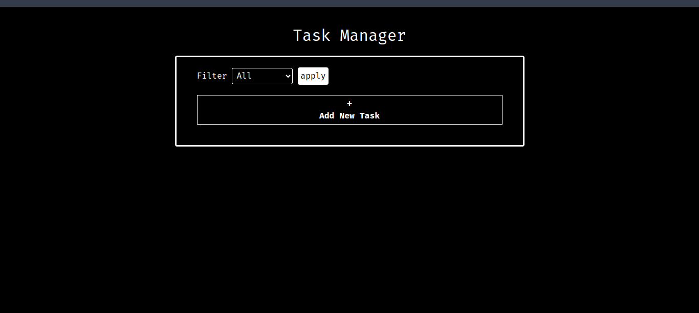
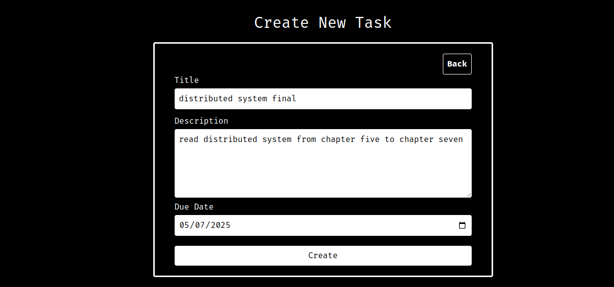
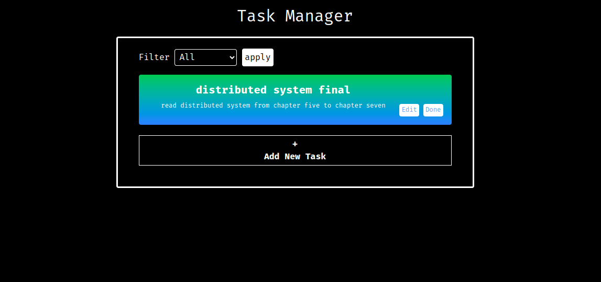
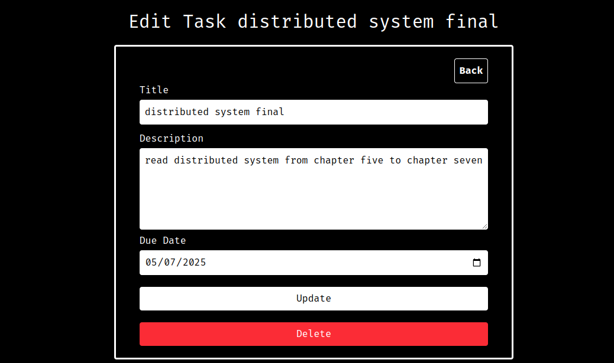
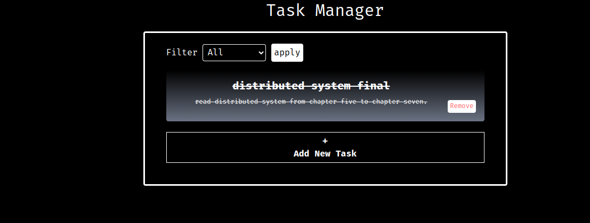

## Task Management

This applications allow the users to create, update , delete and mark as complete tasks it is a basic application fully built with laravel, uses basic routing and several laravel tools such as elqouent models and controllers, and got other features like filtering.

## Installation step

1. clone the repo

```bash
git clone https://github.com/abubekersh/task-manager.git
```

2. create the database

```sql
CREATE DATABASE task_manager
```

3. migrate the database schema

```bash
cd task-manager
php artisan migrate
```

4. run the php server

```bash
php artisan serve
```

## Screenshoots

1.home page
 2. create tasks
 3. tasks list with filtering on
 4. edit tasks
 5. marking tasks complete

